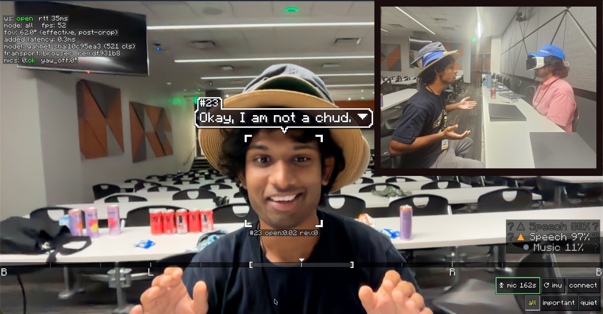

+++
title = "C-HUD Vision"
date = 2026-09-27T00:00:00Z
period = "Sep 2026"
summary = "A cap-mounted 4-microphone array and phone HUD that localizes, classifies, and captions environmental sounds for d/Deaf and hard-of-hearing wearers. Built at HackGT 26."
tags = ["Python", "TypeScript", "ESP32", "FastAPI", "WebSocket", "Audio ML", "Accessibility", "HackGT"]
+++

### What it is

**C-HUD Vision** (Cap Heads-Up Display) turns an ordinary cap into a real-time sound-awareness wearable. Four microphones on the brim pick up the world around the wearer; a laptop backend figures out *where* a sound came from and *what* it is; and the phone already in the wearer's pocket renders a camera HUD with bearing markers, class labels, and speech captions anchored to the face that spoke.

Phone transcription apps give you the words, but not the *who* or the *where*. C-HUD puts the array on the wearer's head — the frame that actually matters — so a bearing means "to my left," and it does so without requiring a headset, AR glasses, or any hardware to buy.

Built in 36 hours at **HackGT 26** by a four-person team.  
[github.com/carn181/hackgt-26](https://github.com/carn181/hackgt-26) · [Devpost submission](https://devpost.com/software/chud)

---

### Tech stack

| Layer | Technologies |
|---|---|
| Hardware | ESP32-S3, Adafruit ICS-43434 I2S microphones, Arduino/ESP-IDF 3.x |
| Backend | Python 3.11, FastAPI, WebSockets, NumPy/SciPy, ai-edge-litert, faster-whisper, pyserial |
| HUD | TypeScript, Vite, Canvas 2D, MediaPipe Tasks Vision, Web Audio API |
| Transport | UDP (hat ↔ backend), WebSocket/WSS (backend ↔ HUD), USB-CDC fallback |
| ML models | YAMNet TFlite (521 classes), faster-whisper |

---

### How it works

1. **Wearable sensor array.** Four Adafruit ICS-43434 I2S microphones mount on the cap brim as two sample-locked stereo pairs, driven by an ESP32-S3. The firmware runs a coarse on-device direction estimate from per-mic loudness/imbalance and broadcasts small telemetry packets over UDP and USB serial.

2. **Backend audio pipeline (Python).** A FastAPI + WebSocket server ingests audio from the hat, the HUD's own microphone, or a file; detects onsets; estimates direction with GCC-PHAT per pair and SRP-PHAT when enough channels are live; classifies with YAMNet (521 AudioSet classes); and transcribes speech with faster-whisper on a worker thread. A fusion stage ties audio bearings to camera observations.

3. **Phone HUD (TypeScript + Vite).** A canvas 2D overlay on the live camera feed draws a bearing compass, per-event markers with class/confidence/accuracy, mirrored candidates when the array is front/back ambiguous, edge chevrons for off-screen sounds, and caption bubbles pinned to detected faces via MediaPipe. The phone can also stream its own microphone back to the backend.

---

### Architecture & design

- **Modular DSP pipeline.** Stages are explicit and independently testable: `ingest`, `detect`, `doa`, `classify`, `asr`, `fuse`, `urgency`.
- **Honest uncertainty.** A straight line of microphones cannot tell front from back. The backend emits an `ambiguous` flag and the HUD draws two mirrored candidates rather than guessing. When localization fails, `source: none` still reports the class with `accuracy_deg: 180` so the marker fades instead of lying.
- **Accuracy from measurement.** `accuracy_deg` is mandatory and derived from the measured delay spread, not a softmax confidence.
- **Local-first.** YAMNet and Whisper run on the laptop in the room. No cloud service is in the loop.
- **Calibration against reality.** The array's effective spacing is calibrated using the camera while someone talks, instead of trusting a CAD drawing.

---

### Measured results

Every number below was produced by a script in the repo:

| Metric | Result |
|---|---|
| Onset → client latency | **p50 378 ms** |
| YAMNet inference | **5.65 ms** per 0.975 s window (XNNPACK CPU) |
| DOA on synthetic audio (−60°…+60°) | **±1.7°** on laptop pair, **±6.0°** on modelled hat geometry |
| UDP packet path | **150/150** packets, 50.0 pps/ch, 0 sequence gaps |

---

### What I learned

- **Uncertainty is part of the answer.** The most useful design decision was making the interface carry the doubt inherent to a 1-D array instead of hiding it.
- **Filtering is the feature.** For accessibility, an alarm that outranks everything else is worth more than a firehose of every sound.
- **Measure the pipeline, don't assert it.** We split latency into onset→backend, backend→client, and round-trip ping so regressions were localized immediately.
- **Honest diagnostics save demos.** A status chip showing model hash, transport, per-mic health, and frame rate turned "why is nothing showing up" from an hour of guessing into a five-second read.

---

### What's next

A real measured microphone bar so the TDOA/SRP path runs live, a WS2812 LED strip on the brim for screen-free direction, elevation from a crown microphone, and a vibrotactile band for silent, eyes-free cues.
